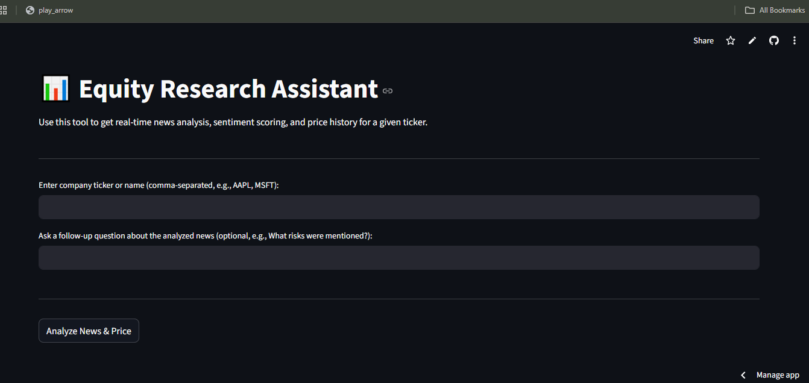

# GenAI Equity Research Assistant

An AI-powered financial analysis tool that combines **real-time news summarization**, **sentiment analysis**, and **stock price visualization** — built with **Python, Streamlit, and Hugging Face Llama-3 API**.

---

## Overview

This project allows users to:

- Fetch **latest financial news** for a company (e.g., AAPL, MSFT)
- Generate **summaries and sentiment** using a Large Language Model (Llama 3)
- Merge results with **live stock market data**
- Visualize **Stock Price vs Sentiment** for clear trend insights
- Ask **follow-up questions** (RAG-based query system) to get deeper insights from recent news

---

## 🖼️ Screenshots

### 1. Dashboard Overview



## Key Features

| Feature                                         | Description                                                       |
| ----------------------------------------------- | ----------------------------------------------------------------- |
| **LLM-based Summarization**                     | Generates concise 3-sentence summaries of financial news          |
| **Sentiment Scoring**                           | Classifies news as _Bullish_, _Bearish_, or _Neutral_             |
| **RAG System (Retrieval-Augmented Generation)** | Lets users ask contextual questions about the analyzed news       |
| **Stock Price Integration**                     | Pulls and visualizes historical stock price data using `yfinance` |
| **Streamlit Frontend**                          | Clean, interactive dashboard for company-wise analysis            |

---

## Tech Stack

- **Frontend:** Streamlit
- **Backend:** Python (LangChain-style custom helper functions)
- **APIs:** Hugging Face Inference API (Llama 3.1–8B-Instruct)
- **Libraries:** `pandas`, `matplotlib`, `yfinance`, `faiss`, `sentence-transformers`, `dotenv`
- **Model Used:** `meta-llama/Llama-3.1-8B-Instruct`

---

## Setup Instructions

```bash
### Clone the repository
git clone https://github.com/<prajna-17>/genai-equity-tool.git
cd genai-equity-tool

### Create a Virtual Environment
python -m venv .venv
source .venv/bin/activate      # for macOS/Linux
.venv\Scripts\activate         # for Windows

pip install -r requirements.txt

### Add Your Hugging Face Token
Create a .env file in the project root:
HUGGINGFACEHUB_API_TOKEN=your_hf_token_here

### Run the App
streamlit run app.py


```
